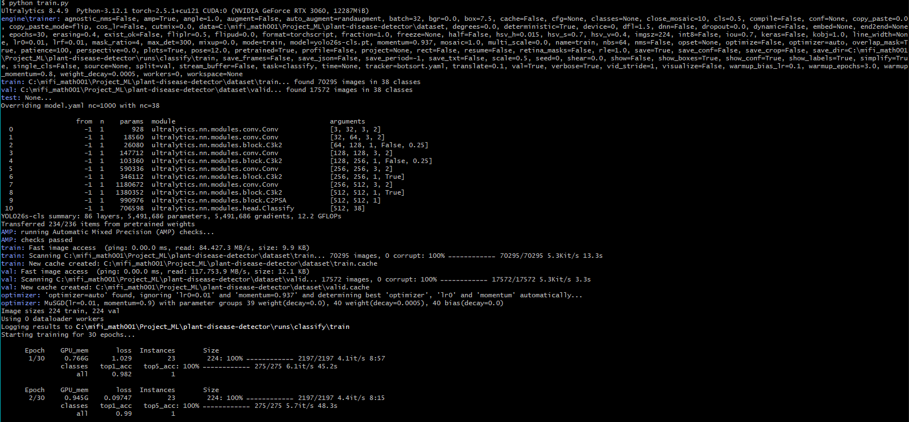
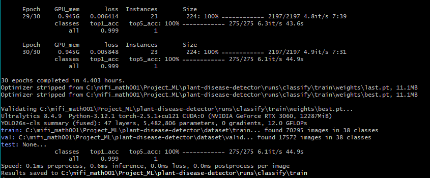
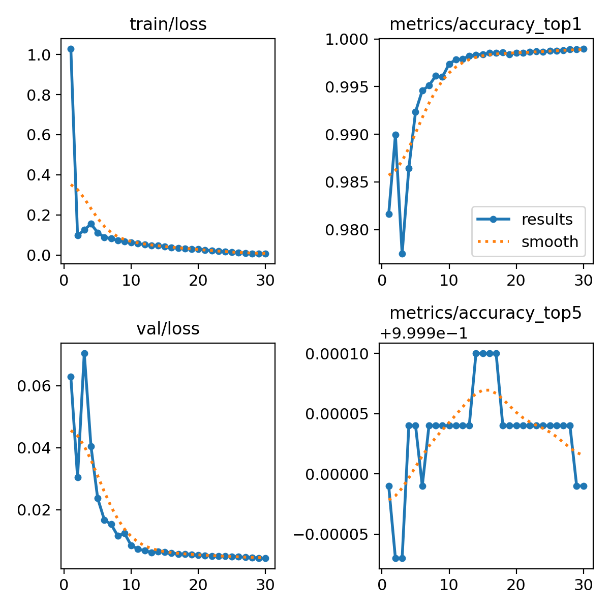
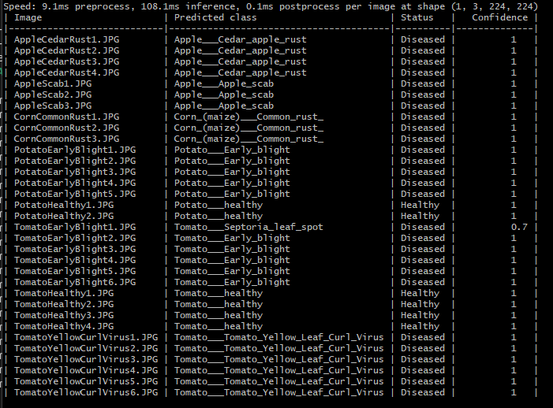
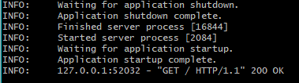
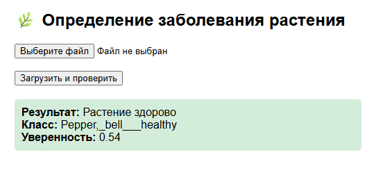
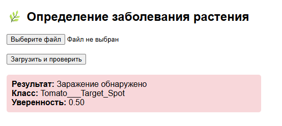

# Определение заболеваний растений по фотографии листьев 🌿

## 📘 Описание проекта
Проект выполнен в рамках **проектной практики онлайн-магистратуры МИФИ «Машинное обучение» (1 семестр)**.

Цель проекта — разработка системы автоматического определения заболеваний растений по фотографиям листьев с использованием методов машинного обучения и компьютерного зрения.

---

## 🧠 Используемая модель

**Модель:** `YOLO26s-cls`

### Обоснование выбора модели
Модель **YOLO26s-cls** была выбрана для решения задачи классификации изображений по следующим причинам:

- модель специально предназначена для задач **image classification**;
- использование **предобученных весов ImageNet** позволяет эффективно применять transfer learning и сократить время обучения;
- высокая скорость инференса при сохранении хорошей точности;
- простая интеграция через библиотеку **ultralytics**;
- хорошая масштабируемость и возможность адаптации под расширение числа классов.

---

## 📊 Используемый датасет

**New Plant Diseases Dataset**

Датасет выбран по следующим причинам:

- полностью соответствует задаче классификации заболеваний растений по изображениям листьев;
- содержит большое количество размеченных изображений различных сельскохозяйственных культур;
- включает как **здоровые растения**, так и растения с различными заболеваниями;
- масштаб и разнообразие данных снижают риск переобучения;
- удобная структура данных для интеграции с моделями классификации;
- широко используется в научных и учебных проектах, что обеспечивает воспроизводимость результатов.

📎 Ссылка на датасет:  
https://www.kaggle.com/datasets/vipoooool/new-plant-diseases-dataset/

---

## ⚙️ Подготовка окружения

### 1. Установка зависимостей
```bash
pip install -r requirements.txt
```

### 2. Загрузка и подготовка датасета

1. Скачайте датасет **New Plant Diseases Dataset**.
2. Разместите директории `train` и `valid` в директории `dataset/`.
3. Директорию `test` поместите в корень проекта.

Пример структуры проекта:
```
project_root/
├── dataset/
│   ├── train/
│   └── valid/
├── test/
├── train.py
├── predict.py
├── app.py
└── requirements.txt
```

---

## 🏋️ Обучение модели

1. Настройте параметры обучения в файле `train.py`.
2. Запустите обучение:
```bash
python train.py
```




Обученные веса сохраняются в директории `runs/` и уже присутствуют в репозитории.

---

## 📊 Результаты обучения модели

В процессе обучения модели автоматически формируется файл `runs/classify/train/results.png`, содержащий визуализацию ключевых метрик обучения.



На графиках отображаются:
- динамика функции потерь (loss) на обучающей выборке;
- значения функции потерь на валидационной выборке;
- точность классификации (Top-1 Accuracy);
- изменение скорости обучения (Learning Rate) по эпохам.

Анализ графиков позволяет оценить сходимость модели, качество обучения и наличие переобучения.
Уменьшение значений loss и рост accuracy свидетельствуют о корректном процессе обучения и способности модели обобщать данные.

---

## 🧪 Тестирование модели
```bash
python predict.py
```



---

## 🌐 Использование модели
```bash
uvicorn app:app --reload --port 8000
```




Web-интерфейс доступен по адресу:  
http://localhost:8000

Пример обнаружения здорового листа растения



Пример обнаружения зараженного листа растения


